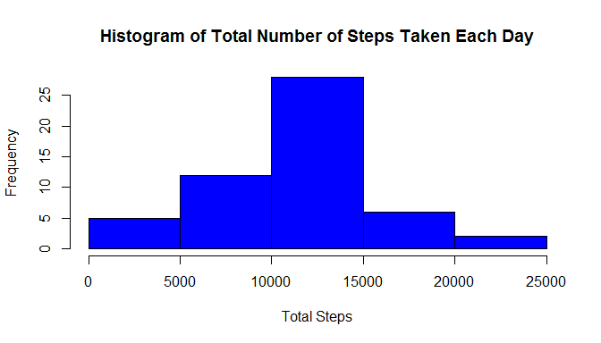
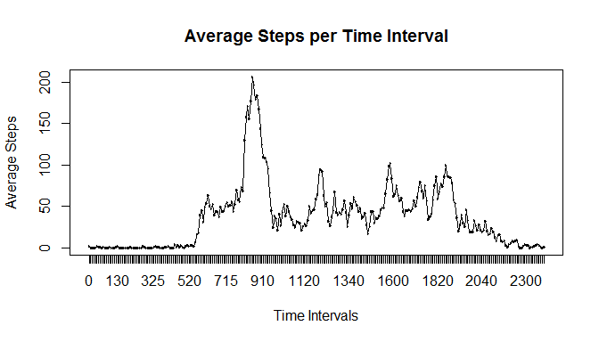
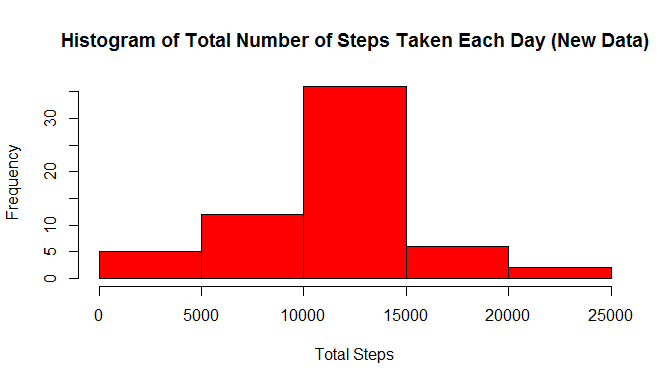
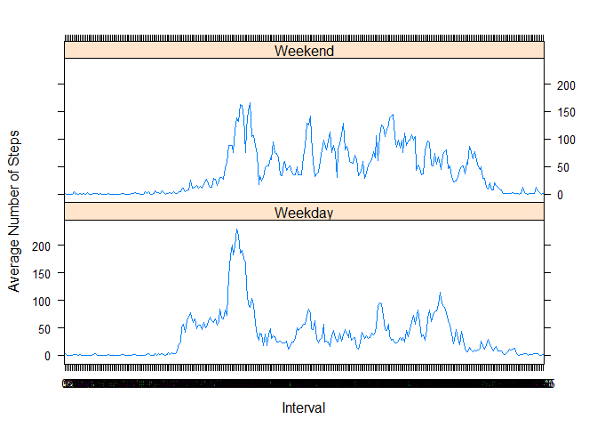

# Reproducible Research: Peer Assessment 1


## Loading and preprocessing the data
###Loading the Raw Data into the workspace

```r
library(knitr)
```

```
## Warning: package 'knitr' was built under R version 3.1.2
```

```r
library(xtable)
```

```
## Warning: package 'xtable' was built under R version 3.1.2
```


```r
activity <- read.csv(unz("activity.zip", "activity.csv"))
activity$Date <- as.Date(activity$date)
activity$interval <- as.factor(activity$interval)
```

###Removing the NA's

```r
vec <- complete.cases(activity)
data <- activity[vec,]
```


## What is mean total number of steps taken per day?

###Part 1: Histogram of Total Steps Taken Each Day:

```r
stepstable <- aggregate(steps~date, data = data, sum)
hist(stepstable$steps, main = "Histogram of Total Number of Steps Taken Each Day", xlab = "Total Steps", col = "blue")
```

 

###Part 2a: Median Number of Steps Per Day

```r
aggregate(steps~date, data = data, median)
```

```
##          date steps
## 1  2012-10-02     0
## 2  2012-10-03     0
## 3  2012-10-04     0
## 4  2012-10-05     0
## 5  2012-10-06     0
## 6  2012-10-07     0
## 7  2012-10-09     0
## 8  2012-10-10     0
## 9  2012-10-11     0
## 10 2012-10-12     0
## 11 2012-10-13     0
## 12 2012-10-14     0
## 13 2012-10-15     0
## 14 2012-10-16     0
## 15 2012-10-17     0
## 16 2012-10-18     0
## 17 2012-10-19     0
## 18 2012-10-20     0
## 19 2012-10-21     0
## 20 2012-10-22     0
## 21 2012-10-23     0
## 22 2012-10-24     0
## 23 2012-10-25     0
## 24 2012-10-26     0
## 25 2012-10-27     0
## 26 2012-10-28     0
## 27 2012-10-29     0
## 28 2012-10-30     0
## 29 2012-10-31     0
## 30 2012-11-02     0
## 31 2012-11-03     0
## 32 2012-11-05     0
## 33 2012-11-06     0
## 34 2012-11-07     0
## 35 2012-11-08     0
## 36 2012-11-11     0
## 37 2012-11-12     0
## 38 2012-11-13     0
## 39 2012-11-15     0
## 40 2012-11-16     0
## 41 2012-11-17     0
## 42 2012-11-18     0
## 43 2012-11-19     0
## 44 2012-11-20     0
## 45 2012-11-21     0
## 46 2012-11-22     0
## 47 2012-11-23     0
## 48 2012-11-24     0
## 49 2012-11-25     0
## 50 2012-11-26     0
## 51 2012-11-27     0
## 52 2012-11-28     0
## 53 2012-11-29     0
```

###Part 2b: Mean Number of Steps per day

```r
aggregate(steps~date, data = data, mean)
```

```
##          date      steps
## 1  2012-10-02  0.4375000
## 2  2012-10-03 39.4166667
## 3  2012-10-04 42.0694444
## 4  2012-10-05 46.1597222
## 5  2012-10-06 53.5416667
## 6  2012-10-07 38.2465278
## 7  2012-10-09 44.4826389
## 8  2012-10-10 34.3750000
## 9  2012-10-11 35.7777778
## 10 2012-10-12 60.3541667
## 11 2012-10-13 43.1458333
## 12 2012-10-14 52.4236111
## 13 2012-10-15 35.2048611
## 14 2012-10-16 52.3750000
## 15 2012-10-17 46.7083333
## 16 2012-10-18 34.9166667
## 17 2012-10-19 41.0729167
## 18 2012-10-20 36.0937500
## 19 2012-10-21 30.6284722
## 20 2012-10-22 46.7361111
## 21 2012-10-23 30.9652778
## 22 2012-10-24 29.0104167
## 23 2012-10-25  8.6527778
## 24 2012-10-26 23.5347222
## 25 2012-10-27 35.1354167
## 26 2012-10-28 39.7847222
## 27 2012-10-29 17.4236111
## 28 2012-10-30 34.0937500
## 29 2012-10-31 53.5208333
## 30 2012-11-02 36.8055556
## 31 2012-11-03 36.7048611
## 32 2012-11-05 36.2465278
## 33 2012-11-06 28.9375000
## 34 2012-11-07 44.7326389
## 35 2012-11-08 11.1770833
## 36 2012-11-11 43.7777778
## 37 2012-11-12 37.3784722
## 38 2012-11-13 25.4722222
## 39 2012-11-15  0.1423611
## 40 2012-11-16 18.8923611
## 41 2012-11-17 49.7881944
## 42 2012-11-18 52.4652778
## 43 2012-11-19 30.6979167
## 44 2012-11-20 15.5277778
## 45 2012-11-21 44.3993056
## 46 2012-11-22 70.9270833
## 47 2012-11-23 73.5902778
## 48 2012-11-24 50.2708333
## 49 2012-11-25 41.0902778
## 50 2012-11-26 38.7569444
## 51 2012-11-27 47.3819444
## 52 2012-11-28 35.3576389
## 53 2012-11-29 24.4687500
```

## What is the average daily activity pattern?
###Part 1: Time Series Plot: Average Steps per Time Interval

```r
stepsbyinterval <- aggregate(steps~interval, data = data,mean)
plot(stepsbyinterval, type = "l", main = "Average Steps per Time Interval", xlab = "Time Intervals", ylab = "Average Steps")
lines(stepsbyinterval$interval,stepsbyinterval$steps)
```

 

###Part2: The Five Minute Interval that constains the max number of steps:

```r
maximum <- stepsbyinterval[stepsbyinterval$steps == max(stepsbyinterval$steps),]
maximum
```

```
##     interval    steps
## 104      835 206.1698
```


The maximum numbers of steps on average across all days is 206.1698113 at interval 835, which corresponds to 8:35am.


## Imputing missing values
###Part 1: Calculate and Report the Total Number of Missing Values

There are 2304 missing values total.

```r
missing <- complete.cases(activity)
summary(missing)
```

```
##    Mode   FALSE    TRUE    NA's 
## logical    2304   15264       0
```


###Part 2: Strategy to fill in the missing values of the data set
Strategy: Replace the missing values within the chart to be equal to the the mean for that five minute interval

###Part 3: Create a new dataset that has the missing values filled in


```r
newactivity <- activity

##Finding Missing Step Cases
missing <- complete.cases(newactivity)

##Substituting the missing values with the average step value based on interval from 
##Old data set "stepsbyinterval"
for (i in 1:nrow(newactivity[!missing,])){
        newactivity[!missing,]$steps[i] <- stepsbyinterval$steps[stepsbyinterval$interval == newactivity[!missing,]$interval[i]] 
}
```
The new dataset is labelled new activity.

####Part 4a: Histogram of Total Number of steps taken each day

```r
newstepstable <- aggregate(steps~date, data = newactivity, sum)
hist(newstepstable$steps, main = "Histogram of Total Number of Steps Taken Each Day (New Data)", xlab = "Total Steps", col = "red")
```

 

###Part 4b: Median Number of Steps Per Day in New Dataset

```r
aggregate(steps~date, data = newactivity, median)
```

```
##          date    steps
## 1  2012-10-01 34.11321
## 2  2012-10-02  0.00000
## 3  2012-10-03  0.00000
## 4  2012-10-04  0.00000
## 5  2012-10-05  0.00000
## 6  2012-10-06  0.00000
## 7  2012-10-07  0.00000
## 8  2012-10-08 34.11321
## 9  2012-10-09  0.00000
## 10 2012-10-10  0.00000
## 11 2012-10-11  0.00000
## 12 2012-10-12  0.00000
## 13 2012-10-13  0.00000
## 14 2012-10-14  0.00000
## 15 2012-10-15  0.00000
## 16 2012-10-16  0.00000
## 17 2012-10-17  0.00000
## 18 2012-10-18  0.00000
## 19 2012-10-19  0.00000
## 20 2012-10-20  0.00000
## 21 2012-10-21  0.00000
## 22 2012-10-22  0.00000
## 23 2012-10-23  0.00000
## 24 2012-10-24  0.00000
## 25 2012-10-25  0.00000
## 26 2012-10-26  0.00000
## 27 2012-10-27  0.00000
## 28 2012-10-28  0.00000
## 29 2012-10-29  0.00000
## 30 2012-10-30  0.00000
## 31 2012-10-31  0.00000
## 32 2012-11-01 34.11321
## 33 2012-11-02  0.00000
## 34 2012-11-03  0.00000
## 35 2012-11-04 34.11321
## 36 2012-11-05  0.00000
## 37 2012-11-06  0.00000
## 38 2012-11-07  0.00000
## 39 2012-11-08  0.00000
## 40 2012-11-09 34.11321
## 41 2012-11-10 34.11321
## 42 2012-11-11  0.00000
## 43 2012-11-12  0.00000
## 44 2012-11-13  0.00000
## 45 2012-11-14 34.11321
## 46 2012-11-15  0.00000
## 47 2012-11-16  0.00000
## 48 2012-11-17  0.00000
## 49 2012-11-18  0.00000
## 50 2012-11-19  0.00000
## 51 2012-11-20  0.00000
## 52 2012-11-21  0.00000
## 53 2012-11-22  0.00000
## 54 2012-11-23  0.00000
## 55 2012-11-24  0.00000
## 56 2012-11-25  0.00000
## 57 2012-11-26  0.00000
## 58 2012-11-27  0.00000
## 59 2012-11-28  0.00000
## 60 2012-11-29  0.00000
## 61 2012-11-30 34.11321
```

###Part 4c: Mean Number of Steps per day in New Dataset

```r
aggregate(steps~date, data = newactivity, mean)
```

```
##          date      steps
## 1  2012-10-01 37.3825996
## 2  2012-10-02  0.4375000
## 3  2012-10-03 39.4166667
## 4  2012-10-04 42.0694444
## 5  2012-10-05 46.1597222
## 6  2012-10-06 53.5416667
## 7  2012-10-07 38.2465278
## 8  2012-10-08 37.3825996
## 9  2012-10-09 44.4826389
## 10 2012-10-10 34.3750000
## 11 2012-10-11 35.7777778
## 12 2012-10-12 60.3541667
## 13 2012-10-13 43.1458333
## 14 2012-10-14 52.4236111
## 15 2012-10-15 35.2048611
## 16 2012-10-16 52.3750000
## 17 2012-10-17 46.7083333
## 18 2012-10-18 34.9166667
## 19 2012-10-19 41.0729167
## 20 2012-10-20 36.0937500
## 21 2012-10-21 30.6284722
## 22 2012-10-22 46.7361111
## 23 2012-10-23 30.9652778
## 24 2012-10-24 29.0104167
## 25 2012-10-25  8.6527778
## 26 2012-10-26 23.5347222
## 27 2012-10-27 35.1354167
## 28 2012-10-28 39.7847222
## 29 2012-10-29 17.4236111
## 30 2012-10-30 34.0937500
## 31 2012-10-31 53.5208333
## 32 2012-11-01 37.3825996
## 33 2012-11-02 36.8055556
## 34 2012-11-03 36.7048611
## 35 2012-11-04 37.3825996
## 36 2012-11-05 36.2465278
## 37 2012-11-06 28.9375000
## 38 2012-11-07 44.7326389
## 39 2012-11-08 11.1770833
## 40 2012-11-09 37.3825996
## 41 2012-11-10 37.3825996
## 42 2012-11-11 43.7777778
## 43 2012-11-12 37.3784722
## 44 2012-11-13 25.4722222
## 45 2012-11-14 37.3825996
## 46 2012-11-15  0.1423611
## 47 2012-11-16 18.8923611
## 48 2012-11-17 49.7881944
## 49 2012-11-18 52.4652778
## 50 2012-11-19 30.6979167
## 51 2012-11-20 15.5277778
## 52 2012-11-21 44.3993056
## 53 2012-11-22 70.9270833
## 54 2012-11-23 73.5902778
## 55 2012-11-24 50.2708333
## 56 2012-11-25 41.0902778
## 57 2012-11-26 38.7569444
## 58 2012-11-27 47.3819444
## 59 2012-11-28 35.3576389
## 60 2012-11-29 24.4687500
## 61 2012-11-30 37.3825996
```

Comparing the two histograms, one can see the histogram with the NA's filled in has a higher max frequency than the original data. Then, comparing the median chart, some days now have a value >0 due to the replacement of missing values. Comparing the mean chart, the new mean chart has higher values than the previous one.
The impact of the imputing missing data on the estimates of the total daily number of steps is that the estimates all increased.


## Are there differences in activity patterns between weekdays and weekends?

###Part1: Create a new factor variable in the data set with two levels
Classifying the dates as a "Weekend" or "Weekday"

```r
days <- weekdays(as.Date(newactivity$date))
days <- gsub("Sunday","Weekend",days)
days <- gsub("Saturday","Weekend",days)
weekday <- grep("Weekend",days, invert = TRUE)
days[weekday] <- "Weekday"
newactivity$days <- as.factor(days)
```

###Part2: Make a panel plot containing a timer series of the 5-minute interval vs average number of steps taken, averaged across all weekday days or weekend days


```r
library(lattice)
meandays <- aggregate(steps ~ interval + days, data = newactivity, mean)
xyplot(steps~interval|days, data = meandays, type = c("l"), layout = c(1,2), xlab = "Interval", ylab ="Average Number of Steps")
```

 

From the graphs. you can see that the average steps by interval are greater throughout the whole day on the Weekend, but greater in the morning on weekdays. 


